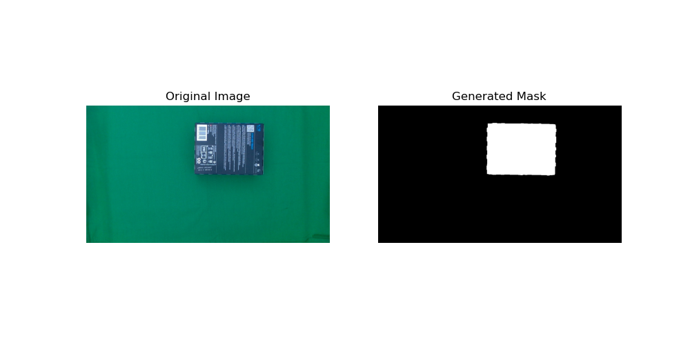
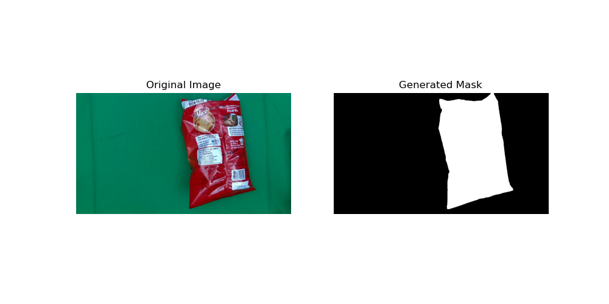

# Color Segmentation in Images: RGB to HSV Conversion

This repository contains a Python script for color segmentation in images, focusing on converting RGB values to the HSV color space and creating masks based on color ranges. The script is particularly effective for processing images with varying luminosity conditions.

## 1. RGB to HSV Conversion

The script starts by defining a set of RGB values representing different samples of a green background under various lighting conditions. RGB, while common in digital images, is less effective for color segmentation as it combines color information with luminance. Thus, we convert these values to the HSV color space using OpenCV's `cvtColor` function, which is better aligned with human perception and more suitable for color-based segmentation tasks.

## 2. HSV Range Calculation

After converting the RGB values to HSV, the script calculates the minimum and maximum values for each HSV channel across all samples. The resulting `min_hsv` and `max_hsv` arrays define the bounds of the green color range in the dataset, taking into account different lighting conditions as reflected in the value channel.

## 3. Range Adjustment

The HSV range is then adjusted for better segmentation robustness:
- **Hue**: Expanded by subtracting 10 from the lower bound and adding 10 to the upper bound to include slight variations in green shades.
- **Saturation**: Lower bound reduced by 80 to include less vibrant greens affected by shadows or highlights.
- **Value (Brightness)**: Expanded by 82 in both directions to account for lighting effects on perceived color.

## 4. Mask Creation

Using the adjusted HSV range, the script segments the image data. It uses OpenCV's `inRange` function to create a binary mask, classifying pixels within this range as part of the object (green background) and those outside as background.

## 5. Results

Below are some examples of the segmentation results using images from the `images_exercice2/` directory:





## Usage

To use this script, run the following command, specifying the input and output directories:

```bash
python exercice2_ameliore.py --input_dir "default/input/directory/path" --output_dir "default/input/directory/path"

---

## Contributing

We welcome contributions from the community! If you have improvements or fixes, please feel free to fork the repository and submit a pull request.

1. **Fork the Repository**: Click on the 'Fork' button at the top right corner of this repository.
2. **Clone Your Fork**: Clone your fork to your local machine.
3. **Create a New Branch**: Create a new branch for your modifications (`git checkout -b new-feature`).
4. **Make Your Changes**: Add your changes to the codebase.
5. **Commit Your Changes**: Commit your changes (`git commit -am 'Add some feature'`).
6. **Push to the Branch**: Push your changes to your remote branch (`git push origin new-feature`).
7. **Create a Pull Request**: Go to your fork on GitHub and click the 'Compare & pull request' button. Fill out the form and submit.

Before submitting a pull request, please ensure your changes adhere to best practices and are properly documented and tested.

Your contributions are greatly appreciated and will help make this tool more effective for everyone!

---

